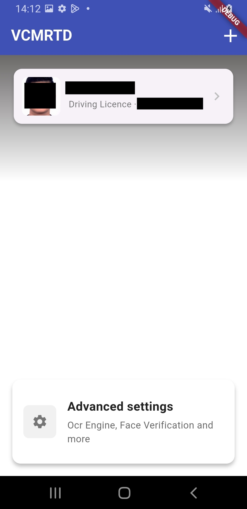
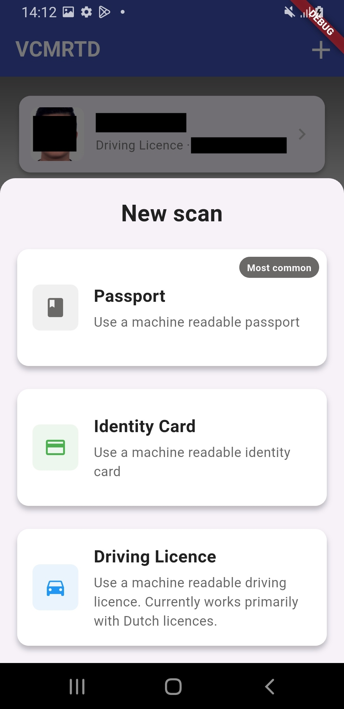

[](https://sonarcloud.io/summary/new_code?id=privacybydesign_vcmrtd)
[](https://sonarcloud.io/summary/new_code?id=privacybydesign_vcmrtd)
[](https://sonarcloud.io/summary/new_code?id=privacybydesign_vcmrtd)
[](https://sonarcloud.io/summary/new_code?id=privacybydesign_vcmrtd)
[](https://sonarcloud.io/summary/new_code?id=privacybydesign_vcmrtd)
[](https://sonarcloud.io/summary/new_code?id=privacybydesign_vcmrtd)
[](https://sonarcloud.io/summary/new_code?id=privacybydesign_vcmrtd)
[](https://codecov.io/gh/privacybydesign/vcmrtd)

# VCMRTD 

This repository contains three Flutter packages for reading and verifying electronic travel documents (ePassports, eID cards, driving licences) and performing biometric face verification built for the [Yivi](https://yivi.app) ecosystem.

## Packages

### [vcmrtd](vcmrtd/)

A Dart/Flutter library for reading Machine Readable Travel Documents (MRTDs) via NFC. Implements ICAO 9303 with BAC and PACE authentication, reads all standard data groups, and integrates with [go-passport-issuer](https://github.com/privacybydesign/go-passport-issuer) for server-side Passive Authentication and Verifiable Credential issuance.

### [mrz_capture](mrz_capture/)

A reusable Flutter package for capturing and recognizing Machine Readable Zones (MRZs).

It provides a camera viewfinder with framing overlay, MRZ text recognition using Google ML Kit by default, and a Tesseract4Android fallback for Android environments where an F-Droid-friendly OCR engine is preferred. It also provides check-digit correction and a manual-entry fallback.

The package depends on `vcmrtd` and the external `mrz_parser` package.

### [face_verification](face_verification/)

A Flutter package for face verification and liveness detection. Supports active liveness (gesture challenges) and passive liveness (anti-spoofing + rPPG heart rate), plus face matching against the DG2 photo from the NFC chip. Runs entirely on-device in a background isolate using bundled TFLite models.

The package also contains an optional `iris` sub-package, which provides an alternative face-verification engine based on the proprietary Iris SDK from passportreader.app. Unlike the on-device implementation, Iris provides its own full-screen native camera UI and returns the verification result to Flutter.

The Iris vendor binaries (`iris.aar` and `Iris.xcframework`) are not committed to the repository. See the `face_verification/iris` package README for instructions on providing them locally.

## Example app

The [`vcmrtd/example`](vcmrtd/example/) app demonstrates the full flow: MRZ scanning, NFC reading, face verification, and Verifiable Credential issuance.

The app supports choosing between the on-device `face_verification` engine and the Iris engine through the advanced settings.

<p float="left">




</p>

```sh
cd vcmrtd/example
flutter pub get
flutter run
```

## Related projects

- [go-passport-issuer](https://github.com/privacybydesign/go-passport-issuer) — backend service for document verification and VC issuance
- [GMRTD](https://github.com/gmrtd/gmrtd) — Go library for MRTD operations (used by go-passport-issuer)
- [Yivi](https://yivi.app) — privacy-preserving identity platform

## Attribution

The `vcmrtd` package is based on [dmrtd](https://github.com/ZeroPass/dmrtd) by ZeroPass, with significant modifications and improvements by the Yivi team.

## License

Copyright (C) 2025-2026 Yivi B.V.

This software is free software: you can redistribute it and/or modify it under the terms of the GNU General Public License as published by the Free Software Foundation, either version 3 of the License, or (at your option) any later version.

The full licence text is in [LICENSE](LICENSE). The same text ships with each package: [vcmrtd/LICENSE](vcmrtd/LICENSE), [mrz_capture/LICENSE](mrz_capture/LICENSE), [face_verification/LICENSE](face_verification/LICENSE), and [face_verification/iris/LICENSE](face_verification/iris/LICENSE).

## Funding

This project received funding through [NGI0 Commons Fund](https://nlnet.nl/commonsfund), a fund established by [NLnet](https://nlnet.nl) with financial support from the European Commission's [Next Generation Internet](https://ngi.eu) program. Learn more at the [NLnet project page](https://nlnet.nl/project/Yivi-AgeVerification).

[](https://nlnet.nl)
[](https://nlnet.nl/commonsfund)
