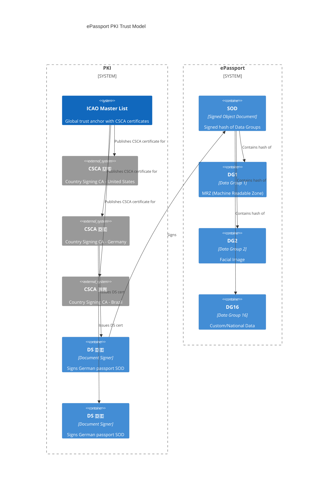

# PKI

## Download ICAO PKI Objects
https://pkddownloadsg.icao.int/download
https://www.npkd.nl/index.html

- The latest collection of eMRTD PKI objects (Document Signer certificates (DSCs), Bar Code Signer certificates (BCSCs/VDSs), Bar Code Signer for non-constrained environments certificates (BCSC-NCs/VDS-NCs) and Certificate Revocation Lists (CRLs)) to verify electronic passports.
- The latest collection of CSCA Master Lists.

files can be opened using Apache Directory Studio.