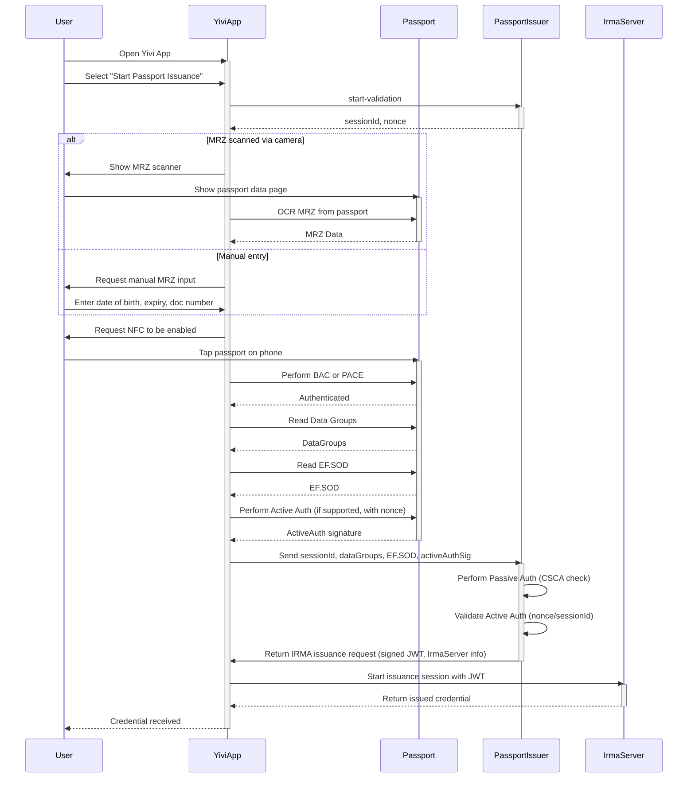

# Sequence diagram

```mermaid
sequenceDiagram
    participant User
    participant YiviApp
    participant Passport
    participant PassportIssuer
    participant IrmaServer

    User->>YiviApp: Open Yivi App
    activate YiviApp
    User->>YiviApp: Select "Start Passport Issuance"
    YiviApp->>PassportIssuer: start-validation
    activate PassportIssuer
    PassportIssuer-->>YiviApp: sessionId, nonce
    deactivate PassportIssuer

    alt MRZ scanned via camera
        YiviApp->>User: Show MRZ scanner
        User->>Passport: Show passport data page
        activate Passport
        YiviApp->>Passport: OCR MRZ from passport
        Passport-->>YiviApp: MRZ Data
        deactivate Passport
    else Manual entry
        YiviApp->>User: Request manual MRZ input
        User->>YiviApp: Enter date of birth, expiry, doc number
    end

    YiviApp->>User: Request NFC to be enabled
    User->>Passport: Tap passport on phone
    activate Passport

    YiviApp->>Passport: Perform BAC or PACE
    Passport-->>YiviApp: Authenticated
    YiviApp->>Passport: Read Data Groups
    Passport-->>YiviApp: DataGroups
    YiviApp->>Passport: Read EF.SOD
    Passport-->>YiviApp: EF.SOD
    YiviApp->>Passport: Perform Active Auth (if supported, with nonce)
    Passport-->>YiviApp: ActiveAuth signature
    deactivate Passport

    YiviApp->>PassportIssuer: Send sessionId, dataGroups, EF.SOD, activeAuthSig
    activate PassportIssuer
    PassportIssuer->>PassportIssuer: Perform Passive Auth (CSCA check)
    PassportIssuer->>PassportIssuer: Validate Active Auth (nonce/sessionId)

    PassportIssuer->>YiviApp: Return IRMA issuance request (signed JWT, IrmaServer info)
    deactivate PassportIssuer

    YiviApp->>IrmaServer: Start issuance session with JWT
    activate IrmaServer
    IrmaServer-->>YiviApp: Return issued credential
    deactivate IrmaServer

    YiviApp-->>User: Credential received
    deactivate YiviApp


```