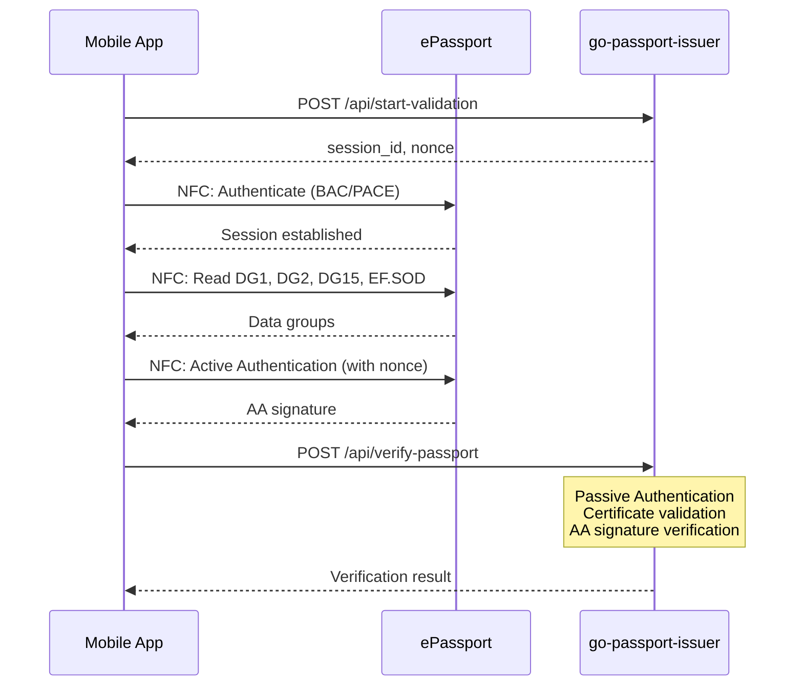

# Integration Guide

This guide explains how to integrate VCMRTD with your backend for secure document verification.

## Why Server-Side Verification?

While VCMRTD reads document data directly from the chip, **Passive Authentication**—the cryptographic verification that the data is genuine—must be performed server-side. This is because:

1. **Certificate Chain Validation**: Verifying the Document Signer Certificate requires access to trusted Country Signing CA certificates (masterlists)
2. **Masterlist Management**: Masterlists must be regularly updated and securely stored
3. **Security**: Keeping verification logic server-side prevents tampering

## go-passport-issuer

VCMRTD is designed to work with [go-passport-issuer](https://github.com/privacybydesign/go-passport-issuer), a Go backend service that handles:

- Passive Authentication (PA)
- Active Authentication (AA) verification
- Certificate chain validation
- Dutch and German masterlist support
- Optional Verifiable Credential issuance via IRMA

### Verification Flow



## Implementation

### 1. Configure the Passport Issuer

```dart
import 'package:vcmrtd/vcmrtd.dart';

final issuer = DefaultPassportIssuer(
  hostName: 'https://your-passport-issuer.example.com',
);
```

### 2. Start a Verification Session

Before reading the document, start a session to get a nonce for Active Authentication:

```dart
final session = await issuer.startSessionAtPassportIssuer();
// session.sessionId - Unique session identifier
// session.nonce - Challenge for Active Authentication
```

### 3. Read the Document

Pass the session parameters to the reader:

```dart
final result = await reader.readDocument(
  iosNfcMessages: (state) => _getIosMessage(state),
  activeAuthenticationParams: session, // Include session for AA
);
```

### 4. Verify Server-Side

Send the raw document data to the backend for verification:

```dart
if (result != null) {
  final (document, rawData) = result;

  // Verify with backend
  final verification = await issuer.verifyPassport(rawData);

  if (verification.passiveAuthenticationPassed) {
    print('Document is authentic!');
  }

  if (verification.activeAuthenticationPassed) {
    print('Chip is genuine (not cloned)!');
  }
}
```

## Complete Example

```dart
import 'package:vcmrtd/vcmrtd.dart';

class PassportVerificationService {
  final PassportIssuer issuer;

  PassportVerificationService({required this.issuer});

  Future<VerificationResult> verifyPassport({
    required String documentNumber,
    required DateTime dateOfBirth,
    required DateTime dateOfExpiry,
  }) async {
    // Start backend session
    final session = await issuer.startSessionAtPassportIssuer();

    // Configure reader
    final accessKey = DBAKey(
      documentNumber: documentNumber,
      dateOfBirth: dateOfBirth,
      dateOfExpiry: dateOfExpiry,
    );

    final nfc = NfcProvider();
    final reader = DocumentReader(
      documentParser: PassportParser(),
      dataGroupReader: DataGroupReader(accessKey: accessKey, nfc: nfc),
      nfc: nfc,
      config: DocumentReaderConfig(
        readIfAvailable: {
          DataGroups.dg1,
          DataGroups.dg2,
          DataGroups.dg15,
        },
      ),
    );

    // Read document
    final result = await reader.readDocument(
      iosNfcMessages: (state) => 'Reading passport...',
      activeAuthenticationParams: session,
    );

    if (result == null) {
      throw Exception('Failed to read document');
    }

    final (document, rawData) = result;

    // Verify with backend
    final verification = await issuer.verifyPassport(rawData);

    return VerificationResult(
      document: document,
      passiveAuthPassed: verification.passiveAuthenticationPassed,
      activeAuthPassed: verification.activeAuthenticationPassed,
    );
  }
}

class VerificationResult {
  final DocumentData document;
  final bool passiveAuthPassed;
  final bool activeAuthPassed;

  VerificationResult({
    required this.document,
    required this.passiveAuthPassed,
    required this.activeAuthPassed,
  });

  bool get isAuthentic => passiveAuthPassed;
  bool get isNotCloned => activeAuthPassed;
}
```

## Verifiable Credentials (Optional)

For integration with the [Yivi](https://yivi.app) ecosystem, you can issue Verifiable Credentials after successful verification:

```dart
// After successful verification, issue credentials
final sessionPointer = await issuer.startIrmaIssuanceSession(
  rawData,
  DocumentType.passport,
);

// The session pointer can be used to open the Yivi app
// for credential acceptance
```

## API Endpoints

The go-passport-issuer backend exposes the following endpoints:

| Endpoint | Method | Description |
|----------|--------|-------------|
| `/api/start-validation` | POST | Start verification session |
| `/api/verify-passport` | POST | Verify passport data |
| `/api/verify-driving-licence` | POST | Verify driving license data |
| `/api/issue-passport` | POST | Verify and issue passport credential |
| `/api/issue-driving-licence` | POST | Verify and issue driving license credential |
| `/api/health` | GET | Health check |

See the [Backend API Reference](./api/backend) for detailed request/response formats.

## Driving License Support

VCMRTD also supports Dutch electronic driving licenses:

```dart
// Use DrivingLicenceParser instead of PassportParser
final parser = DrivingLicenceParser();

final reader = DocumentReader(
  documentParser: parser,
  dataGroupReader: dataGroupReader,
  nfc: nfc,
  config: config,
);

// Verify with appropriate endpoint
final verification = await issuer.verifyDrivingLicence(rawData);
```

## Error Handling

Handle verification failures gracefully:

```dart
try {
  final verification = await issuer.verifyPassport(rawData);

  if (!verification.passiveAuthenticationPassed) {
    // Document signature invalid - possibly tampered or forged
    handleInvalidDocument();
  }

  if (!verification.activeAuthenticationPassed) {
    // Chip may be cloned
    handlePossibleClone();
  }
} on Exception catch (e) {
  // Network or server error
  handleVerificationError(e);
}
```

## Next Steps

- [Backend API Reference](./api/backend) - Detailed API documentation
- [Technical Reference](./reference/standards) - Learn about MRTD standards
- [Example Application](./example/overview) - See a complete implementation
