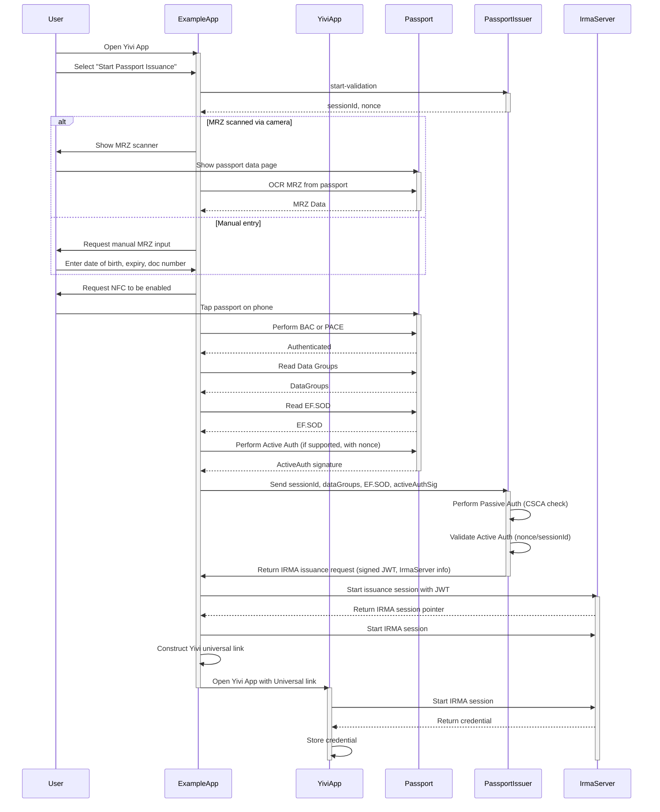
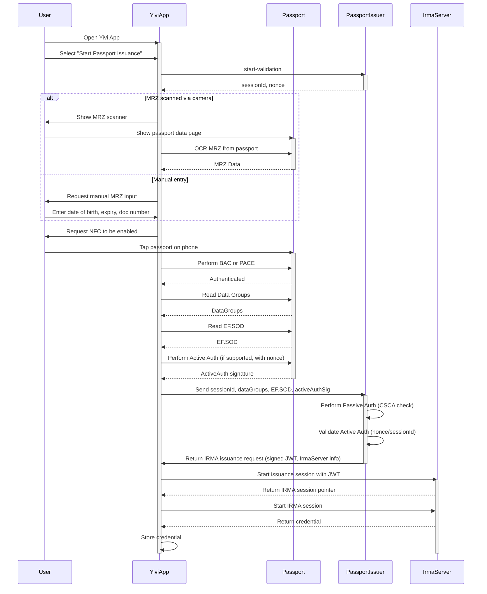

# Passport Issuance Flows
There are **two distinct flows** for issuing a passport-based credential, depending on whether the process is initiated in the **Example App** or directly inside the **Yivi App**. The overall sequence of interactions is very similar (scanning MRZ, NFC reading, validation at the issuer, IRMA issuance), but there is one important difference:  
- In the **Example App flow**, the Example App orchestrates the NFC reading and validation, then hands over to the Yivi App via a universal link to complete the issuance.  
- In the **Yivi App flow**, all steps (including NFC reading, issuer communication, and credential storage) are handled within the Yivi App itself. No external app is needed.

## Key Differences
- **Example App**:  
  - Acts as a “proxy” between the user and Yivi.  
  - Performs NFC reading, passive and active authentication locally.  
  - Only after obtaining issuer validation does it pass the issuance request to the Yivi App via a universal link.  
  - Yivi App is only involved at the final stage: the actual credential issuance and storage.

- **Yivi App**:  
  - Acts as a self-contained flow.  
  - Handles the entire process from MRZ scanning, NFC reading, issuer communication, to credential storage.  
  - No need to context switch between apps.  
  - This is closer to what a real-world user flow would look like in production.

## Sequence diagrams
### Example App

### Yivi App

