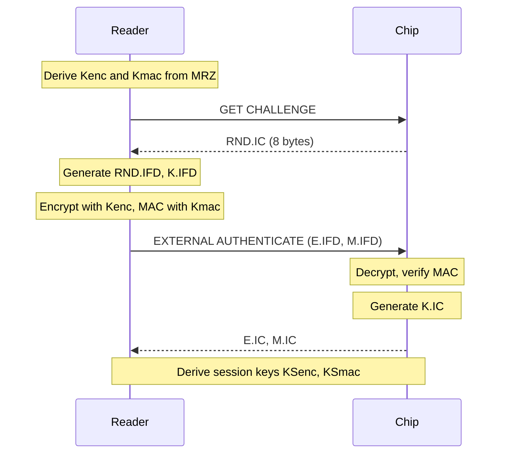
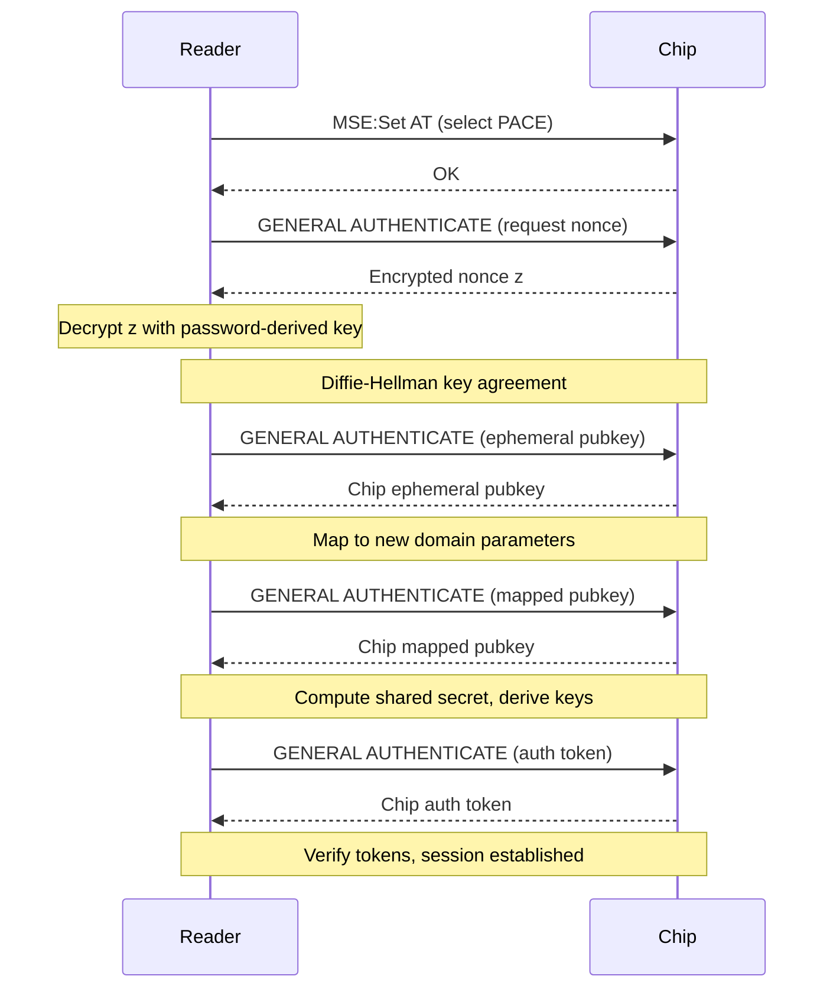
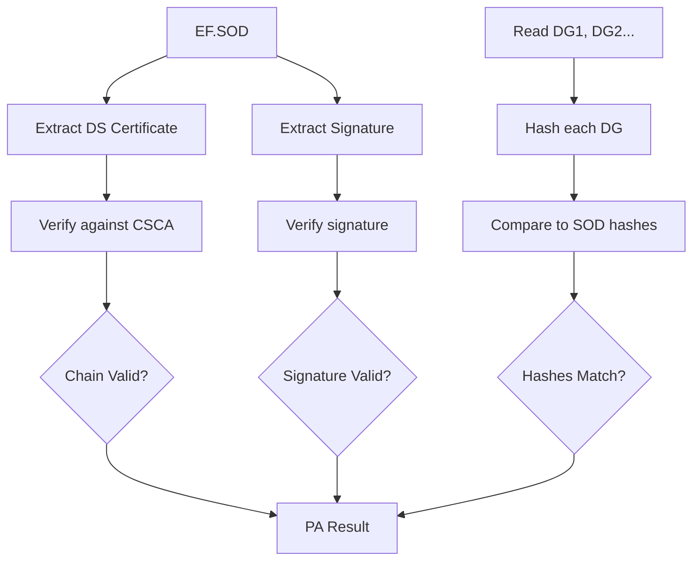
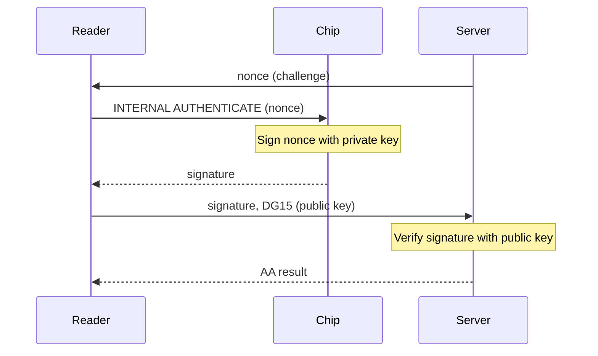

# Authentication Protocols

MRTD security involves multiple authentication protocols. This document explains each protocol and how VCMRTD implements them.

## Overview

| Protocol | Purpose | Where Performed |
|----------|---------|-----------------|
| BAC | Prevent unauthorized reading | Client (VCMRTD) |
| PACE | Prevent unauthorized reading (stronger) | Client (VCMRTD) |
| PA | Verify data integrity | Server (go-passport-issuer) |
| AA | Prevent chip cloning | Client + Server |
| EAC | Access protected biometrics | Partial support |

## Basic Access Control (BAC)

BAC prevents unauthorized reading of passport data by requiring knowledge of MRZ information.

### How It Works



### Key Derivation

Session keys are derived from:
- Document number (from MRZ)
- Date of birth (from MRZ)
- Date of expiry (from MRZ)

### VCMRTD Implementation

```dart
final accessKey = DBAKey(
  documentNumber: 'AB1234567',
  dateOfBirth: DateTime(1990, 1, 15),
  dateOfExpiry: DateTime(2030, 1, 15),
);
```

### Limitations

- Susceptible to eavesdropping if MRZ data is known
- Uses 3DES encryption (considered weak by modern standards)
- Brute-force attacks possible with sufficient captured traffic

## PACE (Password Authenticated Connection Establishment)

PACE is a stronger alternative to BAC, required on EU passports since 2014.

### Advantages Over BAC

- Uses Diffie-Hellman key agreement
- Resistant to eavesdropping
- Uses AES encryption
- Multiple password sources (MRZ, CAN, PIN)

### How It Works



### Password Sources

| Source | Description |
|--------|-------------|
| MRZ | Derived from document number, DOB, expiry |
| CAN | Card Access Number (6 digits printed on card) |
| PIN | Personal identification number |

### VCMRTD Implementation

VCMRTD automatically attempts PACE if BAC fails and EF.CardAccess is present:

```dart
// PACE is handled automatically
// You can also use CAN explicitly:
final accessKey = CANKey(can: '123456');
```

## Passive Authentication (PA)

PA verifies that passport data is genuine and unmodified. It is the **only mandatory** security protocol.

### How It Works

1. **At Issuance**:
   - Issuing authority hashes all data groups
   - Signs the hash collection with Document Signer key
   - Stores signature in EF.SOD

2. **At Verification**:
   - Read EF.SOD from chip
   - Verify signature against Document Signer Certificate
   - Verify certificate chain to trusted CSCA
   - Hash each data group, compare to signed hashes



### Why Server-Side?

PA requires:
- Access to trusted CSCA certificates (masterlists)
- Regular masterlist updates
- Certificate Revocation List (CRL) checking
- Secure key storage

These are better handled server-side.

### VCMRTD Implementation

VCMRTD reads EF.SOD and sends it to go-passport-issuer for verification:

```dart
final verification = await issuer.verifyPassport(rawData);
if (verification.passiveAuthenticationPassed) {
  // Data is authentic
}
```

## Active Authentication (AA)

AA prevents chip cloning by proving the chip possesses a unique private key.

### How It Works



### Key Points

- Private key never leaves the chip
- Public key stored in DG15
- Challenge-response prevents replay
- Not all passports support AA

### VCMRTD Implementation

```dart
// Start session to get nonce
final session = await issuer.startSessionAtPassportIssuer();

// Read document with AA
final result = await reader.readDocument(
  iosNfcMessages: (state) => 'Reading...',
  activeAuthenticationParams: session, // Include session
);

// Verify (including AA)
final verification = await issuer.verifyPassport(rawData);
if (verification.activeAuthenticationPassed) {
  // Chip is genuine
}
```

### Limitations

- Optional protocol - not all passports include DG15
- Requires server round-trip for nonce
- Only proves chip authenticity, not data integrity

## Extended Access Control (EAC)

EAC protects sensitive biometric data (fingerprints, iris) on EU passports.

### Components

1. **Chip Authentication (CA)**: Proves chip is genuine, establishes secure session
2. **Terminal Authentication (TA)**: Proves terminal is authorized to read protected data

### Chip Authentication

Similar to AA but:
- Uses Diffie-Hellman for key agreement
- Establishes stronger session keys
- Public key in DG14 or EF.CardSecurity

### Terminal Authentication

Requires:
- Certificate issued by Document Verifier (DV)
- DV certificate issued by Country Verifying CA (CVCA)
- Countries must exchange CVCA certificates

### Current Support

VCMRTD has partial EAC support:
- ✓ Chip Authentication
- ✗ Terminal Authentication (requires infrastructure)

Without TA, protected data groups (DG3, DG4) cannot be read.

## Protocol Selection

VCMRTD automatically selects the best available protocol:

```
1. Try BAC
   ↓ (if fails)
2. Read EF.CardAccess
   ↓
3. Try PACE with MRZ-derived key
```

## Security Recommendations

1. **Always verify server-side**: Client-side checks can be bypassed
2. **Use both PA and AA**: PA verifies data, AA prevents cloning
3. **Check certificate validity**: Ensure certificates haven't expired or been revoked
4. **Keep masterlists updated**: New certificates are regularly issued
5. **Handle failures gracefully**: Not all documents support all protocols
