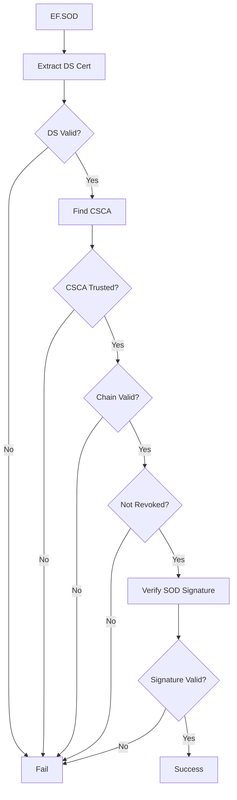

# Public Key Infrastructure

E-passport security relies on a hierarchical Public Key Infrastructure (PKI). This document explains the PKI structure and how VCMRTD uses it.

## PKI Hierarchy

```
ICAO PKD (Public Key Directory)
        │
        ▼
┌───────────────────┐
│  Country Signing  │   Root of trust for each country
│  CA (CSCA)        │
└───────────────────┘
        │
        ▼
┌───────────────────┐
│  Document Signer  │   Signs individual passports
│  (DS)             │
└───────────────────┘
        │
        ▼
┌───────────────────┐
│    Passport       │   Contains signed data
│    (EF.SOD)       │
└───────────────────┘
```

## Country Signing CA (CSCA)

The CSCA is the root certificate authority for a country's passport system.

### Characteristics

- Self-signed certificate
- Long validity (10-20+ years)
- High-security key storage (HSM)
- Signs Document Signer certificates
- One per country (sometimes multiple for transition periods)

### Trust Establishment

Countries exchange CSCA certificates through:
- Bilateral agreements
- ICAO Public Key Directory (PKD)
- Regional organizations (EU Master List)

## Document Signer (DS)

Document Signers are intermediate certificates that sign passports.

### Characteristics

- Signed by CSCA
- Shorter validity (months to a few years)
- One DS may sign many passports
- Countries may have multiple active DS certificates
- Embedded in EF.SOD on each passport

### Certificate Contents

- Subject: Issuing authority
- Issuer: Country Signing CA
- Public key
- Validity period
- Extended key usage: Document Signing

## Security Object Document (EF.SOD)

EF.SOD contains the signed security data for a passport.

### Structure

```
EF.SOD (CMS SignedData)
├── Version
├── Digest Algorithms
├── Encapsulated Content (LDS Security Object)
│   ├── Hash Algorithm
│   ├── Data Group Hash Values
│   │   ├── DG1 hash
│   │   ├── DG2 hash
│   │   └── ...
│   └── LDS Version (optional)
├── Certificates
│   └── Document Signer Certificate
└── Signer Info
    ├── Signature Algorithm
    └── Signature Value
```

### Verification Process

1. Extract DS certificate from EF.SOD
2. Verify DS certificate against trusted CSCA
3. Verify signature on LDS Security Object
4. Hash each data group
5. Compare computed hashes to signed hashes

## ICAO PKD

The ICAO Public Key Directory is a central repository for:
- CSCA certificates
- DS certificates
- Certificate Revocation Lists (CRLs)

### Access

- Subscription required
- Regular updates
- Countries upload their certificates
- Other countries download to verify foreign passports

## Masterlists

A masterlist is a collection of trusted CSCA certificates.

### VCMRTD Masterlist Support

go-passport-issuer includes:
- **Dutch Masterlist**: Netherlands CSCA and related certificates
- **German Masterlist**: German CSCA and related certificates

### Masterlist Format

Common formats:
- LDIF (LDAP Data Interchange Format)
- MLS (ICAO Master List Signer)
- CMS (Cryptographic Message Syntax)

## Certificate Revocation

Certificates can be revoked before expiry:
- Compromised key
- Administrative reasons
- Key rotation

### CRL (Certificate Revocation List)

- Published by CSCA
- Lists revoked DS certificates
- Should be checked during PA

### OCSP

Online Certificate Status Protocol - real-time revocation checking (less common for e-passports).

## Chain Validation

Full validation requires checking:

1. **Certificate chain**: DS → CSCA
2. **Validity periods**: All certificates are current
3. **Revocation status**: No certificates revoked
4. **Signature validity**: Each signature is correct
5. **Key usage**: Certificates are used for intended purpose



## EAC PKI

Extended Access Control adds another PKI layer:

```
┌───────────────────┐
│  Country Verifying│   Issues DV certificates
│  CA (CVCA)        │
└───────────────────┘
        │
        ▼
┌───────────────────┐
│  Document Verifier│   Authorizes inspection systems
│  (DV)             │
└───────────────────┘
        │
        ▼
┌───────────────────┐
│  Inspection System│   Reads protected data
│  (IS)             │
└───────────────────┘
```

### Terminal Authentication

To read protected data (DG3, DG4), an inspection system must:
1. Present IS certificate chain to passport
2. Passport verifies chain to its issuing country's CVCA
3. Passport grants access based on authorization level

### Cross-border EAC

For foreign passports:
- Countries exchange CVCA certificates
- Similar to CSCA exchange for PA
- More complex due to authorization levels

## Security Considerations

### Key Security

- CSCA keys: Ultra-high security (national HSM)
- DS keys: High security (HSM recommended)
- Long-term keys: Higher security requirements

### Certificate Lifetime

| Certificate | Typical Lifetime |
|-------------|------------------|
| CSCA | 10-20+ years |
| DS | 3-15 years |
| Passport signature | Until passport expiry |

### Algorithm Migration

e-Passport standards have evolved:
- Early: RSA-1024, SHA-1
- Current: RSA-2048+, SHA-256+
- Future: Post-quantum considerations

## Implementation in VCMRTD

### Client Side

VCMRTD reads:
- EF.SOD (for PA)
- DG14 (for EAC)
- DG15 (for AA)

### Server Side

go-passport-issuer performs:
- Certificate chain validation
- Masterlist lookups
- Revocation checking
- Signature verification

```dart
final verification = await issuer.verifyPassport(rawData);
// Server handles all PKI validation
```

## Troubleshooting

### "Unknown issuer"

CSCA certificate not in masterlist. Possible causes:
- Passport from unsupported country
- Masterlist out of date
- New CSCA not yet distributed

### "Certificate expired"

DS or CSCA certificate has expired. Note: Many passports have DS certificates that expire before the passport itself expires.

### "Signature invalid"

Could indicate:
- Tampered data
- Corrupted read
- Algorithm mismatch

### "Revoked certificate"

DS certificate has been revoked. Document may need replacement.
